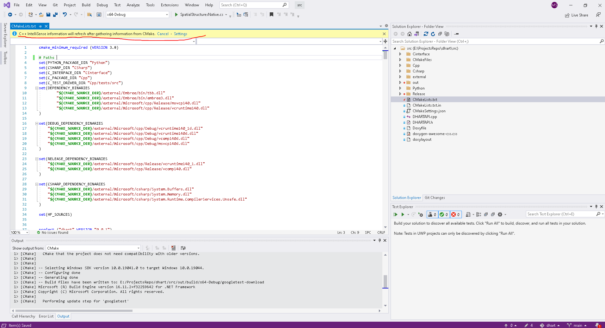
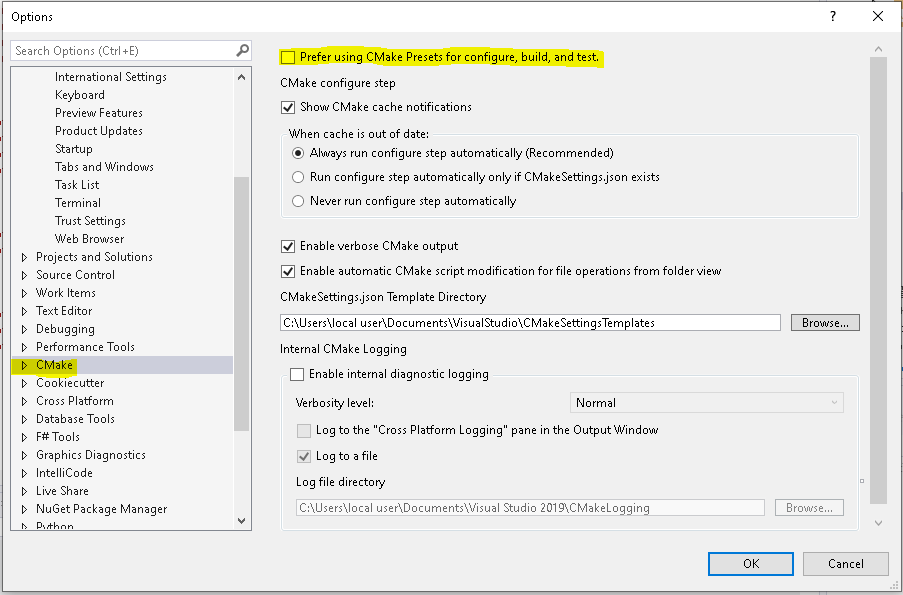
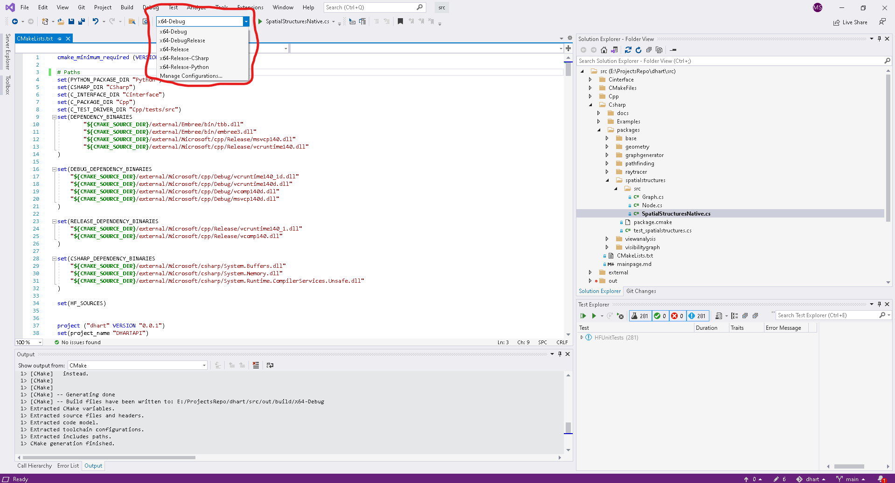
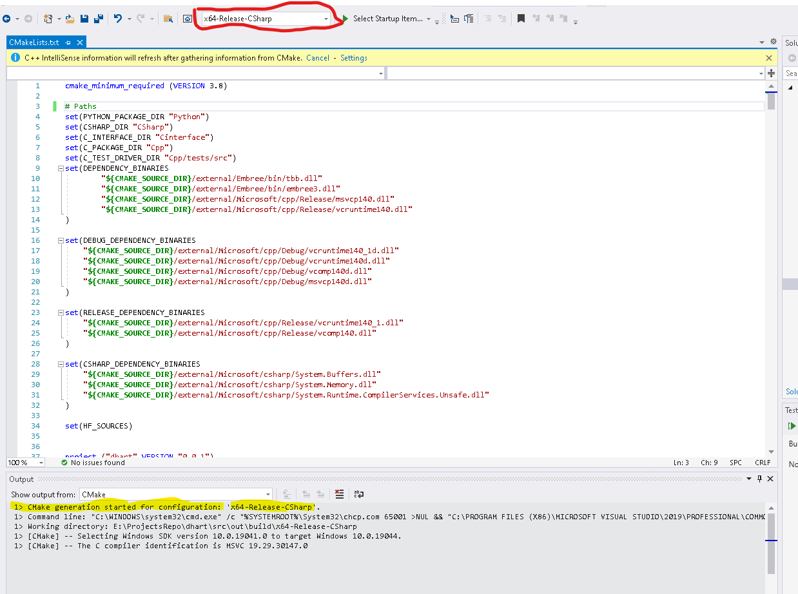
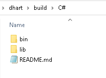
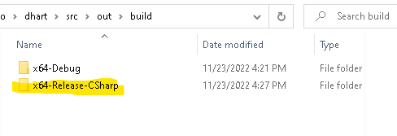
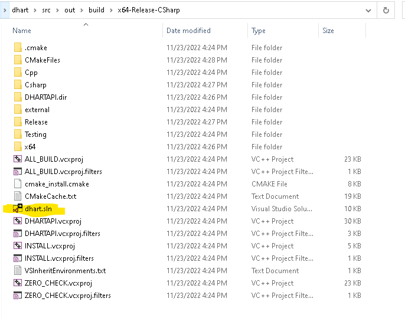
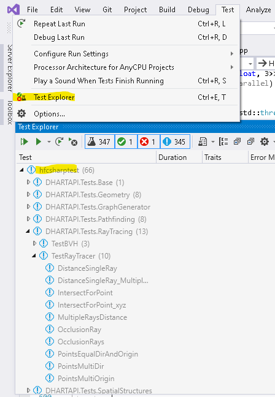

# Prelim

This guide will describe how to retrieve the contents of this repository,
and build from source.

Please note: DHART is currently designed to run on a PC running the Windows 10
operating system.
Also note: This guide is a 'work-in-progress' and subject to change.

- Git for Windows:
If you do not already have Git for Windows on your machine,
please download and install Git for Windows at https://gitforwindows.org/

- Git lfs `https://git-lfs.github.com/`

- Microsoft Visual Studio 2019 (you can use 2022 but 2019 must be installed because of the build tools it comes with):
https://visualstudio.microsoft.com/downloads/
You may use the Community edition. Make sure to also check Windows 10 SDK on the installer.

- CMake (Windows win64-x64)
https://cmake.org/download/

Note for installing CMake, you must check `Add CMake to the system PATH`. The easiest is probably for all users, but you may know how to work with it for current user as well. 

### For Visual Studio

<details>
  <summary>Visual Studio Build Requirements</summary>

You must install the following tools for visual studio. This is found in the _installer_ (not the extensions). 

1. Desktop Development with C++
1. .NET desktop build tools
1. .NET Core development tools
1. .NET Core SDK
1. .NET Framework 4.5 targeting pack
1. .NET Framework 4.5.1 targeting pack
1. .NET Framework 4.5.2 targeting pack
1. .NET build tools
1. .NET profiling tools
1. .NET Native
1. MSVC v140
1. MSVC v142
1. Windows 10 SDK
1. Testing tools core features - Build Tools

At the time of writing, this list is a little long, and as we narrow down frequent issues we can hopefully reduce the exact features needed.

</details>

### Get DHART

Once the software above is installed on your machine,
you may continue with the following:

0. Open Git Bash.
Git Bash (MINGW64) begins at ~, your home directory.
You may remain here, or navigate to a directory of your choice.
In the next step, you will clone the repository.

1. For SSH Type `git clone git@github.com:cadop/dhart.git` at the prompt
and hit ENTER. The repository will then be cloned to your local machine. For HTTPS use `git clone https://github.com/cadop/dhart.git`. 

! IMPORTANT ! You _must_ install and use `git-lfs`. If you use `git clone` and don't do this next step, you won't have the `.json` files.

1. `cd dhart`
1. `git-lfs pull`

# Build Process

You can build using either CMAKE from the command line, _or_ through Visual Studio.  Please note the instructions for Visual Studio as they still require the CMAKE installation within visual studio. 

## Using CMAKE Command Line

<details>
  <summary>CMAKE Build Details</summary>

Currently we directly call the configuration arguments when using cmake. (If someone would like to contribute to improving this process feel free to open an issue. )

Python Debug

1. `cmake ./src/ -G"Visual Studio 16 2019" -DCMAKE_GENERATOR_PLATFORM="x64"  -DCMAKE_CONFIGURATION_TYPES="Debug" -DCMAKE_INSTALL_PREFIX=".\..\build\Python" -DDHARTAPI_Config="All" -DDHARTAPI_EnableTests="False" -DDHARTAPI_EnablePython="True" -DDHARTAPI_EnableCSharp="False" -DINSTALL_GTEST="False"  ".\" 2>&1` 

1. `cmake --build . --config Debug`

Python Release

1. `cmake ./src/  -G"Visual Studio 16 2019"  -DCMAKE_GENERATOR_PLATFORM="x64"   -DCMAKE_INSTALL_PREFIX=".\..\build\Python" -DDHARTAPI_Config="All" -DDHARTAPI_EnableTests="False" -DCMAKE_CONFIGURATION_TYPES="Release" -DDHARTAPI_EnablePython="True" -DDHARTAPI_EnableCSharp="False" -DINSTALL_GTEST="False"  ".\" 2>&1`

1. `cmake --build . --config Release`

If you are using C#, then following the same script as above for Python, you would change the variable `-DDHARTAPI_EnableCSharp="False"` to `"True"`. 


After building (assuming it went okay), run:

1. `cmake --install .`

1. cd to build/Python and run `pip install .`

</details>

------------------

## Using Visual Studio

<details>
  <summary>Visual Studio Build Details</summary>

1. Open Microsoft Visual Studio 2019. After seeing the splash/welcome screen, please click the button that reads Open a local folder.


1. When the Browse window appears, navigate to the folder
(the repository that you had cloned) on your local machine.
Then, navigate to `src/`. Click the Select folder button to confirm.


1. You should see a banner that asks to generate or configure the cmake project.  Click generate. **NOTE**: If you do not see this banner, double click on the `CMakeLists.txt` text file.  


If you still do not see the banner, add a blank space in the file and save (ctrl+s), which should trigger it again, generating the cmake. 




1. This project uses `CMakeSettings.json`, so you must open the CMake options and ensure that CMake configuration file option is set to `Use CMakePresets.json if available, otherwise use CMakeSettings.json`. Depending on the version of Visual Studio, you may need to uncheck the setting `Prefer using CMake Presets...`.  You need to also make sure there is no `CMakePresets.json` since this will overwrite the proper settings.




1. If the Solution Explorer view is not already open, you may open by
navigating to View > Solution Explorer, or alternatively, you can also use the Ctrl + Alt + L shortcut to reveal Solution Explorer. Here, you can examine the sources imported by Visual Studio.


1. We are now ready to build.
CMake is used to aid in the compilation process.
There are a few provided configuration files. Specifically, debug and release, as well as C# and Python specific ones.  



1. Select the one you are interested in and navigate to Build > Build All. For example, the release version of C# is shown in the image below.



1. If you have already built the project, you want to select Rebuild All


You should see the output log success.


At this point you have two options: (1) Use the install command to generate the dll's or (2) open the build directory which will have a visual studio solution that you can use to develop for `DHART`. 

#### Release/Install

1. Once it has successfully built, you need to install.  Going back to the same build menu dropdown, click on install. 


Note that this is not "install on my computer" but rather it runs the CMAKE install script which copies the necessary DLLs to an output folder, which you can use in your own projects. This will save the files to a build directory. 





#### Develop

Instead of clicking install, you can continue from the `Rebuild All` step above by navigating to the output directory of the build.




You can find the build files in `.\dhart\src\out\build\x64-Debug` or `x64-Release` or (whatever config you selected.)  There should be a visual studio solution that is generated for you.  




After you open this solution file, the project structure should be more familiar. 

Please make sure to open the solution after closing the original Visual Studio project where you opened the `src` as a folder.  There have been issues in the past with these two instances locking files and conflicting. 

The easiest first step is to run the existing tests. You can find the test explorer under `Test`



If you had selected a config for C#, you should see `hfcsharptest` dropdown, which are the unittests for C#. There should also be `HFUnitTests`, which provide the C++ and C interface tests.  

You can right click on any individual test or on a group and run the tests (also in debug mode to step through the code). 

Hint: The easiest way to try out the interface and changes is to copy an existing unit test, change its name, and run that test.  You can change C# and C++ files, run a test, and it _should_ rebuild for you as necessary. 

Once you are done with your changes, you can start this tutorial again to build/install (make a release) of the `dll`'s. 

</details>

------------------
### Testing

<details>
  <summary>Testing Details</summary>
After generating the build files, you should be able to open a visual studio solution file in the build directory.  If it doesn't display immediately, go to `Test -> Test Explorer` to open the test explorer. Then click `Run All`. 

</details>

-------------------
## FAQ
<details>
  <summary>FAQ Details</summary>

- `CMake Error: CMAKE_CSharp_COMPILER not set, after EnableLanguage` | This likely occurs because your `CMakeSettings.json` is not correct. If you did not use `git-lfs pull`, this file will just be a lfs object pointer. 
- `CMake Error at X:\XXX\dhart\src\CMakeLists.txt:37: No CMAKE_C_COMPILER could be found.` | This is likely because you are missing the cmake installation or its not configured. Remember, you need _both_ to install cmake from cmake.org _and_ to include it in the visual studio installation settings.
- Some error talking about tests or google-tests. | We use google-tests for the unit testing of the project.  If you are struggling to build because of this error, you can edit the `CMakeSettings.json` in visual studio and uncheck the `EnableTests` option and `Build_GMOCK` for the configuration you are interested in using.
- Cannot run the install because of the following error:
```
Severity	Code	Description	Project	File	Line	Suppression State
Error	MSB3073	The command "setlocal
"C:\Program Files (x86)\Microsoft Visual Studio\2019\Community\Common7\IDE\CommonExtensions\Microsoft\CMake\CMake\bin\cmake.exe" -DBUILD_TYPE=RelWithDebInfo -P cmake_install.cmake
if %errorlevel% neq 0 goto :cmEnd
:cmEnd
endlocal & call :cmErrorLevel %errorlevel% & goto :cmDone
:cmErrorLevel
exit /b %1
:cmDone
if %errorlevel% neq 0 goto :VCEnd
:VCEnd" exited with code 1.	INSTALL	C:\Program Files (x86)\Microsoft Visual Studio\2019\Community\MSBuild\Microsoft\VC\v160\Microsoft.CppCommon.targets	149	
```
It is usually caused when the visual studio solution is opened and a failed build was run on one of the projects inside (or something like this). In general its a write access issue. Close all VS instances, go to the src folder, delete `.vs` folder, and delete `out` folder. Reopen VS with the source folder and build/install again. 


</details>
