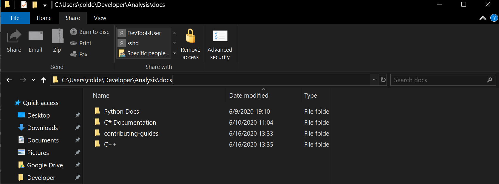
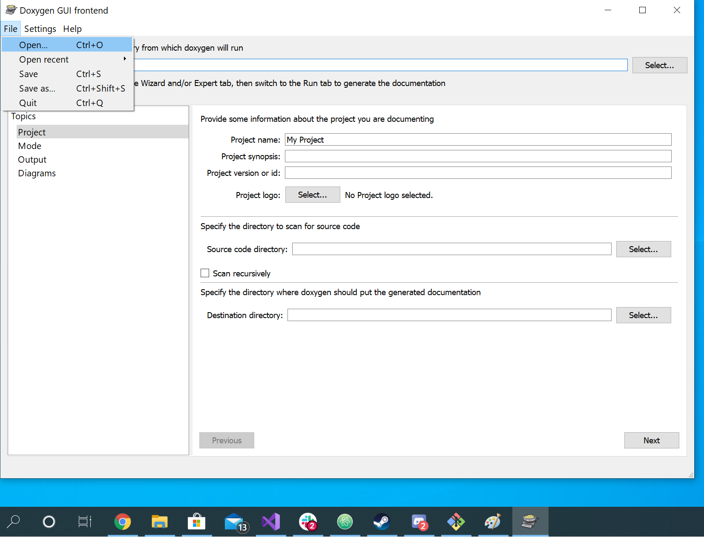
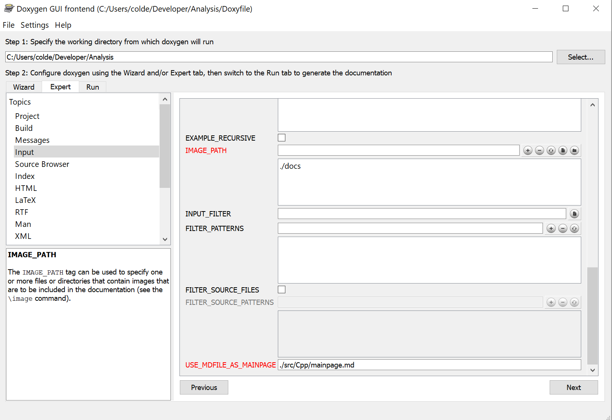
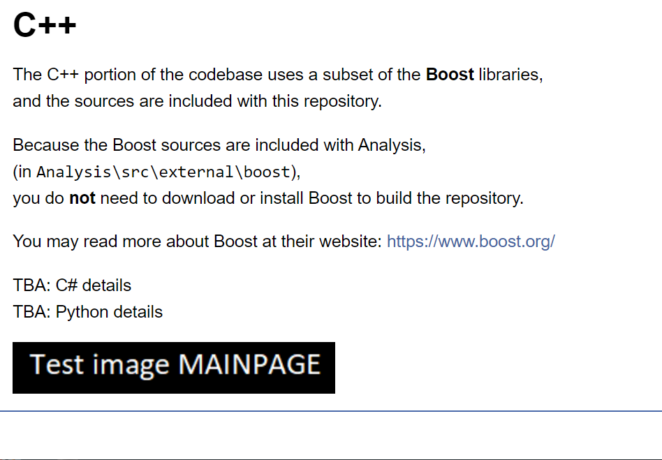

**Documentation**
Documentation is vital and must be done throughout the project, not the end.<br>
This includes examples for the use of each function.<br>

*Non-unity users*

<h1>Python</h1>
* Sphinx
* Numpydocs formatting
* Must comply with doctest
* Must include examples

<h1>C++</h1>
* Doxygen
* Must have a getting started page for each module
* links to C# and Python interfaces for each function, module

<h1>Unity users</h1>
* Doxygen

There are three users of the codebase.
- People that will develop the foundation of the code (includes people like you).
- People that will use the interfaces and our codebase as an API.
- People that will use final products that are built with the codebase.

Each user group must be considered at each stage.

Coding standards are important, sometimes there is the ‘industry standard’ way.<br>
This is not always in alignment with the needs of the project or with research.<br>
It’s likely some things will be different, it should always be discussed and clarified.<br>
It should also be in the documentation.

<h1>Python</h1>
* pep8 convention in most cases (ask otherwise)
* Do not make everything a class. A class should only be used when it is very clearly necessary. Algorithms should be done in a functional way.
* Do not add dependencies without making an issue on why you need it (this goes for libraries that are not already listed as dependencies for the code)

<h1>C#</h1>
* Naming Conventions and Coding Standards have to be well followed (https://sites.google.com/site/wcfpandu/student-of-the-month/c-coding-standards-and-naming-conventions)
* Code general architecture should be discussed and well maintained.

<h1>Doxygen Guidelines</h1>
<b>Overview</b><br>
* Methods and xml format to use in methods
* Algorithms should be documented inline with source rather than headers
* Interface details should remain with headers

<b>Table of contents</b><br>
- Using TODO
- Documenting the heads of each file
- Documenting member fields
- Snippets and Code Samples
- Adding images for headers/sources, and markdown files (<code>.md</code>)

<h2>Using <code>TODO</code></h2>
To have a TODO automatically pull to documentation use:<br>
<code>/// TODO:</code>

<h2>Documenting the heads of each file (headers and sources)</h2>

<b>The head of each file should contain the following tags:</b><br>

<code>\file</code><br>
Name of a file<br>
e.g. <b><code>/// \file     node.h</code></b><br>
https://www.doxygen.nl/manual/commands.html#cmdfile

<code>\brief</code><br>
A one-line description describing the contents of the file<br>
e.g. <b><code>/// \brief    Header file for a node data structure, used in a graph ADT</code></b><br>
https://www.doxygen.nl/manual/commands.html#cmdbrief

<code>\author</code><br>
The author of the file<br>
If there are multiple authors,<br>
you may use one <code>\author</code> tag for all of the authors,<br>
or one <code>\author</code> tag per person/entity.<br>
e.g. <b><code>/// \author   John Doe</code></b><br>
https://www.doxygen.nl/manual/commands.html#cmdauthor

<code>\date</code><br>
This may be the date of the file's last update,<br>
or the date the file was created -- whichever is relevant.<br>
e.g. <b><code>/// \date   06 Jun 2020</code></b><br>
https://www.doxygen.nl/manual/commands.html#cmddate

An example of a file head would look like this:

<code>///
/// \file       node.h
/// \brief      Header file for a node data structure, used in a graph ADT
///
/// \author     John Doe
/// \date       06 Jun 2020
///</code>

Other notes:<b>
- Follow each <code>///</code> with a <b>single</b> space, before using a tag.
- Follow each tag with <b>two</b> tabs, then provide the description.

<h2>Documenting member fields</h2>

Here is a simple example:<br>
<code>struct position {
    float x, y, z;  ///< Cartesian coordinates x, y, and z
    int id;         ///< Unique identifier
};</code>

The general format is <code>///< Description goes here</code>,<br>
notice that a <b>single whitespace character</b> follows <code>///<</code><br>
and the field descriptions are in alignment with each other, using tabs.<br>
Sometimes, this is not always possible,<br>
but do your best to keep the formatting <b>neat</b> and <b>consistent</b>.

<h2>Snippets and code samples</h2>

<h3>The <code>\snippet</code> tag should be used for long examples that are over 10 lines.</h3>
https://www.doxygen.nl/manual/commands.html#cmdsnippet

<b>Step 0:</b><br>
In a header file, at the line where you want the snippet to appear:

<code>/// \snippet PATH_TO_FILE\filename.cpp SnippetName</code>

If you would like to include line numbers for the snippet, you may use the tag
<code>\snippet{lineno}</code>
This is best used for directly referencing source files from within this repo,
since the line numbers that appear are the actual line numbers of the code used
for the snippet.

<b>Step 1:</b><br>
In <code>PATH_TO_FILE\filename.cpp</code> (where the snippet sample is),

<code>/// [SnippetName]
std::cout << "My sample snippet" << std::endl;
/// [SnippetName]
</code>

Notice that the code is not a comment.

<b>Step 2:</b><br>
The following steps utilize the Doxygen GUI Frontend.

Load the Doxyfile from this repo into Doxygen, using the File menu.
The Doxyfile is in <code>Analysis\src\Doxyfile</code>

<b>Step 3:</b><br>
- Navigate to the Expert tab on the left hand side.
- Under topics, click 'Input'.
- On the right side, scroll down until you see EXAMPLE_PATH.
- In the EXAMPLE_PATH section, click the folder button to reveal a file prompt.
- Within the file prompt, select the file path where the snippet resides. (<code>PATH_TO_FILE\filename.cpp</code>)
- Add any more directories/paths where your snippets will come from.

Snippets will now appear when you navigate to the Run tab, and click 'Run Doxygen'.

<h3>The <code>\code</code> tag should be used for code block examples under 10 lines.</h3>
https://www.doxygen.nl/manual/commands.html#cmdcode

Here is an example for using the <code>\code</code> tag:

```
/*!
    \code
        // Use the '//' comment style.
        std::cout << "Here is a test statement." << std::endl;
        
        // You may indent your code sample as needed.
        struct my_point {
            double m_x;
            double m_y;
        };
    \endcode
*/
```

Follow these steps to ensure consistency within the codebase:
0. Start an example block with <code>/*!</code>, then hit <b>ENTER</b> to go to the next line.
1. Hit <b>TAB</b> once, then use the <code>\code</code> tag. Then, hit <b>ENTER</b>.
2. Hit <b>TAB</b> twice, then begin your code example. You may indent as necessary for your example.
 
3. When your example is finished, hit <b>ENTER</b>, then <b>BACKSPACE</b> so that you are inline with the <code>\code</code> tag.
4. Use the <code>\endcode</code> tag to end your example.<br>Then hit <b>ENTER, then hit <b>BACKSPACE</b> as many times as necessary so that you are inline with <code>/*!</code>.

5. Finally, end the example block with <code>*/</code>.

- Note that any comments that occur within the sample must begin with <code>//</code>, followed by a whitespace.

This procedure strikes the best compromise between:
- Making sure that comments work within a code example
- Not having to remove <code>//</code> or <code>///</code> per line of the example

<br>This ensures ease of viewing<br>
for anyone reading the source code -- <br>
and also assists Doxygen with the<br>
formatting process for the HTML export.

You may now use <b>'Run Doxygen'</b> to export your documentation.<br>
(There are no extra steps, unlike with the snippet section)

<h2>Adding images for headers/sources, and markdown files (<code>.md</code>)</h2>

For <b>headers/sources</b>,<br>
we will be using the <code>\image</code> tag to add images.<br>
https://www.doxygen.nl/manual/commands.html#cmdimage

For <b>markdown files (<code>.md</code>)</b>,<br>
we will be using the markdown syntax for images.<br>
https://www.doxygen.nl/manual/markdown.html#md_images

In <b>Analysis</b>,<br>
we have a subdirectory named <b>docs</b>.<br>
(<code>Analysis\docs</code>)<br>

The Analysis Doxyfile will already be configured to have it's <code>IMAGE_PATH</code><br>
configured such that its working directory for images begins at<br>
<code>Analysis\docs</code>.<br>
When we proceed to later steps, and we are to insert the path of an image file,<br>
assume that the working directory for images begins at<br>
<code>Analysis\docs.</code>

For example, if a file is saved at:<br>
<code>Analysis\docs\C++\images\spatialstructures\node\test-image_node-h.png</code>,<br>
you will specify the path:<br>
<code>C++\images\spatialstructures\node\test-image_node-h.png</code>.

Notice that the <b>Analysis\docs</b> portion is omitted when specifying the image,<br>
since our Doxyfile will already its <code>IMAGE_PATH</code> configured to begin at <b>Analysis\docs</b>.

<b>Step 0:</b><br>
Begin by saving copy of <b>image_file</b>,<br>
which is the filename of the desired image,<br>
into the following directory:<br>

```
Analysis\docs\language\img\enclosing_folder\module_name
```
<code><b>language</b></code>,<br>
<code><b>enclosing_folder</b></code>,<br>
and <code><b>module_name</b></code> are <b>placeholders</b>.<br>

<code>images</code> will be a subdirectory within <code><b>language</b></code>.

<b>Note:</b><br>
In the <b>Analysis\docs</b> directory,<br>
there are <b>three</b> subdirectories:<br>
for which the <code><b>language</b></code> placeholder applies:
- C# Documentation
- C++
- Python Docs


<b>The contributing-guides subdirectory is for the images in <i>this</i> file.</b>

For <code><b>language</b></code>,<br>
<b>be sure to choose the appropriate subdirectory</b><br>
when saving your image file.

Although this particular example deals with inserting an image<br>
into documentation for a C++ header file,<br>
the same steps will apply for C# or Python sources.<br>

For instance, the full filepath of <code>node.h</code> is<br>
<code><b>Analysis\src\Cpp\spatialstructures\src\node.h</b></code>

<code><b>language</b></code> is <b>C++</b><br>
<code><b>enclosing_folder</b></code> is <b>spatialstructures</b><br>
<code><b>module_name</b></code> is <b>node</b><br>

So, if we wanted to insert an image for any documentation<br>
for <code>node.h</code> or <code>node.cpp</code>,<br>
the image would be saved into the following directory:<br>

<code><b>Analysis\docs\C++\images\spatialstructures\node</b></code>


If directories <code><b>img</b></code>, <code><b>enclosing_folder</b></code>,<br>
or <code><b>module_name</b></code><br>
do not already exist, you may create them.<br>

We can now proceed to editing the file where we want to insert the desired image.<br>
This could be a header/source file (step 1a), or a markdown file (step 1b).<br>

Scroll down to the instructions that apply to your use case.<br>

<h3>Adding an image to a header/source file</h3>

<b>Step 1a:</b><br>
In the header/source file where you want the image to appear,<br>
navigate to the line of code where you want the image to appear.<br>

We will now utilize the <code>\image</code> tag.

At the line where you want the image to appear,<br>
enter the following:

```
/// \image html language\images\enclosing_folder\module_name\image_file
```

Remember this example is using placeholders;<br>
be sure that <b>language</b>, <b>enclosing_folder</b>, <b>module_name</b>,<br>
and <b>image_file</b> correspond to where your image is saved.<br>

Also note that <b>images</b> is a subdirectory within your chosen <b>language</b> directory.<br>

An example use of the <code>\image</code> tag would be:<br>

<code>/// \image html C++\images\spatialstructures\node\test-image_node-h.png</code>


<b>See line 42 - example use of the <code>\image</code> tag.

We will now move on to the <b>Doxygen GUI frontend (Doxywizard)</b> application.

<h3>Adding an image to a markdown file (<code>.md</code>)</h3>

<b>Step 1b:</b><br>
In the markdown file where you want the image to appear,<br>
navigate to the line at which the image should be inserted.<br>

We will now utilize the markdown syntax for images.<br>

At the line where you want the image to appear,<br>
enter the following:

```

```
Remember this example is using placeholders;<br>
be sure that <b>language</b>, <b>enclosing_folder</b>, <b>module_name</b>,<br>
and <b>image_file</b> correspond to where your image is saved.<br>

An example use of the syntax would be:<br>

```

```
<code><b>language</b></code> is <b>C++</b><br>
<code><b>enclosing_folder</b></code> is <b>spatialstructures</b><br>
<code><b>module_name</b></code> is <b>node</b><br>
<code><b>image_file</b></code> is <b>test.png</b>


<b>This particular example is of mainpage.md, in Analysis\src\Cpp</b>

We will now move on to the <b>Doxygen GUI frontend (Doxywizard)</b> application.

<b>Step 2:</b><br>
Open Doxywizard.<br>


In <b>Doxygen GUI frontend (Doxywizard)</b> -- load the repository's Doxyfile.<br>

Click <b>File > Open...</b><br>



The 'Open configuration file' file explorer will appear.<br>
Navigate to your local copy of the Analysis repository,<br>
then click the <b>Doxyfile</b> icon.<br>


<b>Your path to the Analysis repository will differ, depending where it resides locally on your machine.</b>

Upon loading the Doxyfile, it will be preconfigured for <b>C++</b>.

Doxygen's <b>working directory</b> will be the location of the <b>Doxyfile</b>,
which is the root directory of the Analysis repository.

The <b>Source code directory</b> will be configured for <code>./src/Cpp</code><br>
and the <b>Destination directory</b> will be configured for <code>./docs/C++</code>.<br>


<b>This is how the 'Wizard' page for Doxywizard may look for a C++ documentation export.</b>


<b>Change the highlighted portion to Csharp for C# sources, or Python for Python sources.</b>


<b>Change the highlighed portion to C# Documentation for C# exports, or Python for Python exports.</b>

Suggestion:<br>
Before exporting documentation and pushing it to the repository,<br>
change the <b>Destination directory</b> to a test directory of your choice<br>
(relative to your local copy of Analysis on your machine)

To do this,<br>
create a directory on your Desktop, named <b>test_docs</b>.<br>
Then, for <b>Destination directory</b>,<br>
you will want to provide a <b>relative path</b> to <b>test_docs</b>,<br>
from Doxywizard's working directory.<br>
(this will differ, depending on where your copy of Analysis resides on your machine)


<b>For this example, the destination directory is set to move up two parent directories, so that it can reach Desktop/test_docs.</b>

<b>Step 3:</b><br>
The Analysis Doxyfile will be preconfigured to search for images from<br>
<code>Analysis\docs</code>, via the <code>IMAGE_PATH</code> variable.<br>

The current <code>IMAGE_PATH</code> value, <code>./docs</code> <b>should not be removed</b>,<br>
but you may <b>add to it</b> by doing the following:

Click the <b>Expert</b> tab.<br>


Underneath <b>Topics</b> (on the left hand side of the window),<br>
select <b>Input</b>,<br>


then on the right side,<br>
scroll down until you see the text field for <b>IMAGE_PATH</b>.<br>



Click the folder icon for <b>IMAGE_PATH</b>.<br>


In the file explorer window that appears,<br>
navigate to <b>a directory of your choice.</b>.<br>
Then, click <b>Select Folder</b>.<br>


<b>You can add to the IMAGE_PATH by selecting any directory of your choice.</b><br>
<b>The result will be a filepath relative to Doxygen's working directory.</b>

We have now configured another image path for Doxygen.<br>


<b>When Doxygen inserts images into documentation, it will begin its search in the Analysis\docs directory.</b><br>
<b>If you have added another path to IMAGE_PATH (not shown here), it will also search this path.</b>

<b>Step 4:</b><br>


If there is nothing else you would like to configure,<br>
select the <b>Run</b> tab, then click <b>Run doxygen</b>.<br>

Your documentation will now be generated.


Here are some examples for inserting an image into <code>node.h</code>,<br>
and <code>mainpage.md</code>.


<b><code>\image</code> tag was used within <code>node.h</code>.</b>


<b>Markdown syntax for images was used for <code>mainpage.md</code>.</b>

