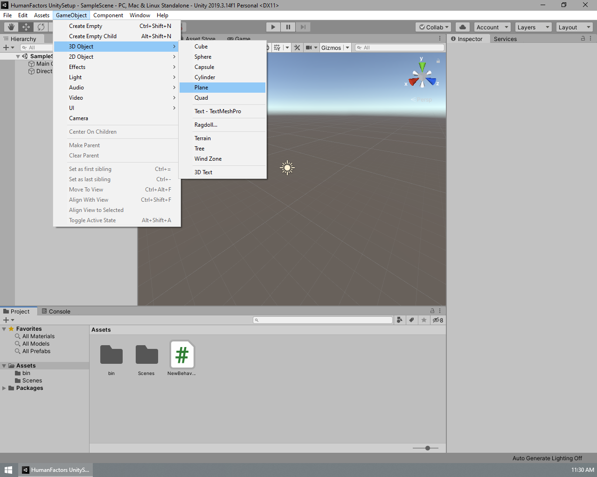
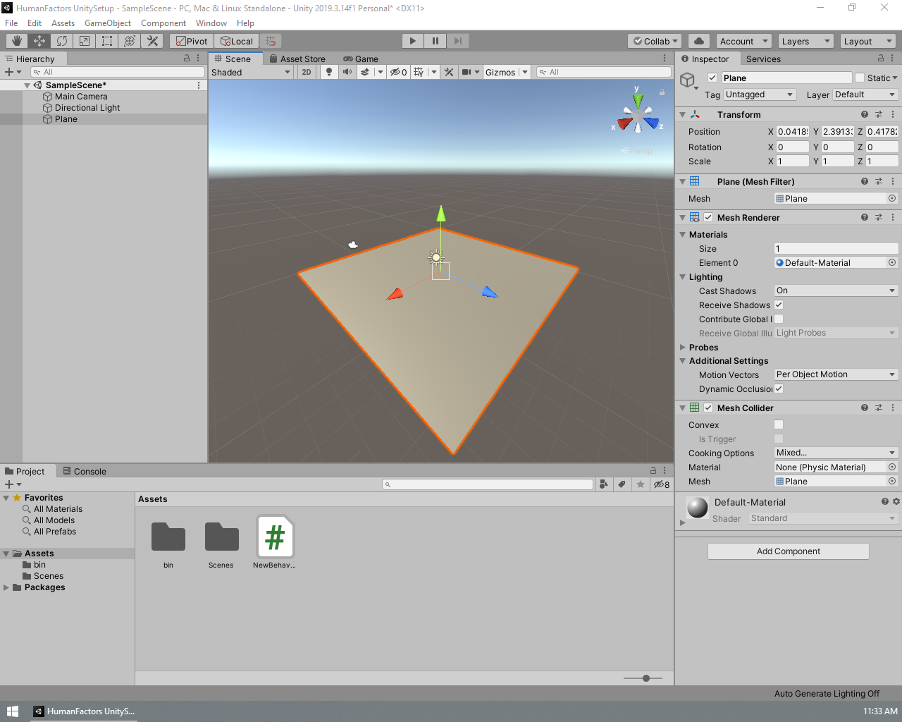
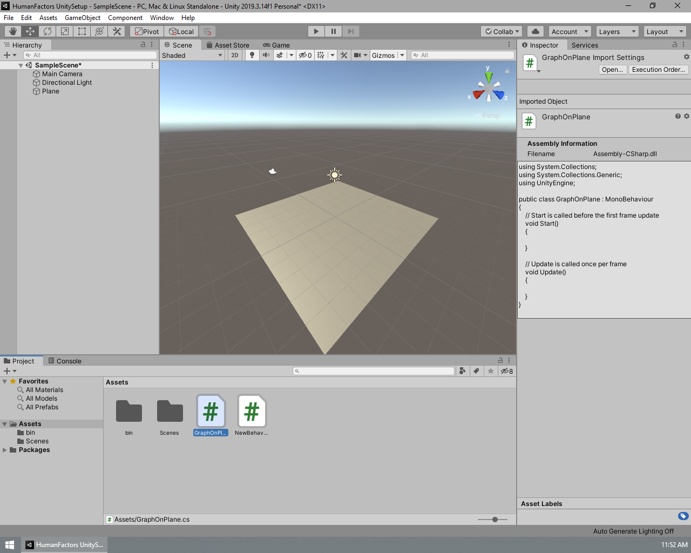
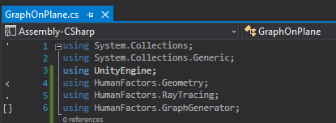
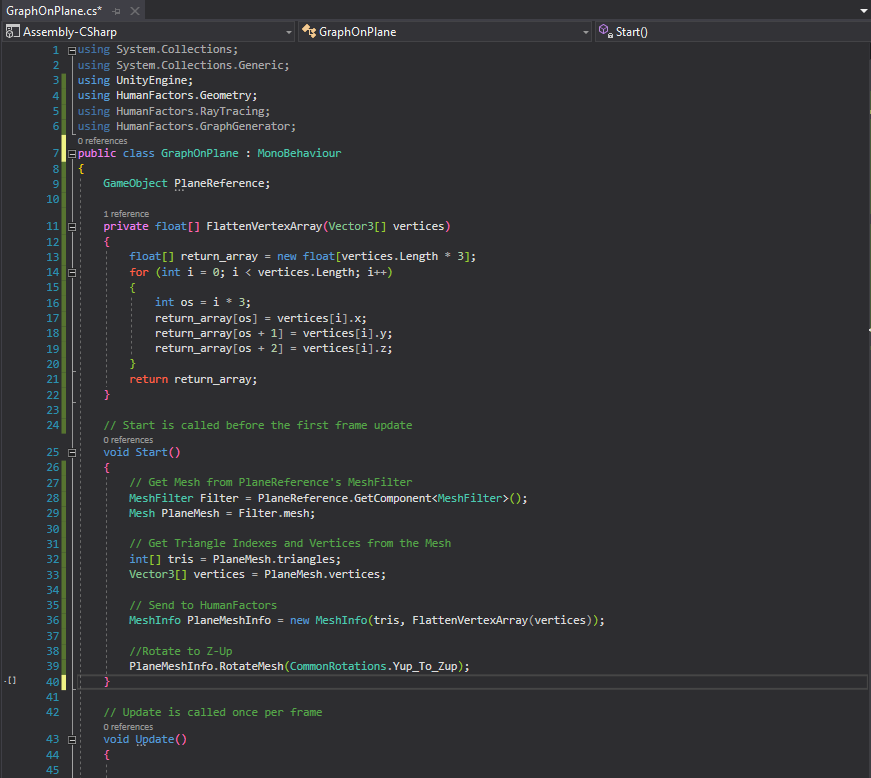

# Reading a Mesh From Unity.

## Before we begin

This guide will demonstrate the following tasks in HumanFactors

1) Passing an existing mesh from a Unity Scene to the HumanFactors Codebase.
2) Creating a BVH for the Embree Ray Tracer
3) Using the Graph Generator to Generate a Graph
4) Retrieving nodes from a HumanFactors Graph

We're going to be starting with the project from the previous guide: [Setting up a Unity Project For Human Factors](UnityProjectSetup.md). If you want to start here, you can download the zipped project from the bottom of the page. **Make sure you have all of the prerequisites before starting this guide.**

## Conceptual Overview

***TODO:*** How much should I flesh this out?

***TODO:*** Visuals?

To put it simply **Graph Generator** maps out "accessible" space on a model from a given starting point. As the name implies, this map of the space is stored as a series of nodes and edges in a **Graph**. Each node represents a point in space that a human can occupy, and each edge between nodes indicates that a human can traverse from one node to another node. The Graph Generator is a powerful tool for analyzing space, since the graph or nodes it outputs can be used as input to all of the analysis methods offered by HumanFactors. This allows the user to go straight from modifying a model or scene, to analyzing it with minimal effort.

## Scene Setup

For this walkthrough we're going to create a single plane in unity, then run the graph generator on it. To begin, open up the Unity Project from [Setting up a Unity Project For Human Factors](UnityProjectSetup.md).


From here we will create a new plane directly at the origin. Using the menubar at the top of the screen select GameObject > 3D Object > Plane.



Once clicked, a new 1x1 plane will have been created, however it may not have been created at the origin exactly. Click on the newly created plane and look at **Transform** header under the inspector in the right sidebar.



If, like in the above image, your plane wasn't created with a Position of X = 0, Y =0 and Z = 0, then you'll have to manually reset its position. This can be done by left clicking on the three dots in the transform header, and selecting *Reset Position*.


After clicking that button, your plane will be moved back to the origin like in the image below.


Now that we have the plane ready to go, it's time to create our script.

## Writing the Script
With the plane in the scene, lets set up our script before moving any further.

### Creating the script
Create a new script using the same process outlined in the first tutorial, except name this one `GraphOnPlane` by typing the name after clicking CreateScript. Now that our new script is created, double click on it to open up Visual Studio.



Once you're in visual studio you should be welcomed by the empty script we're about to fill in. 


### Set Usings
Just like last time, we're going to declare which namespaces this script will use in the using section. GraphOnPlane will require the same usings as the previous project as well as the Graph Generator Namespace

``` C#
using HumanFactors.Geometry;
using HumanFactors.RayTracing;
using HumanFactors.GraphGenerator;
using HumanFactors.SpatialStructures;
```

Your usings for this script should look like this.




### Setup for adding references through the unity inspector

Before we can worry about generating the graph, first we need to get the mesh from the Plane Gameobject we created in the Unity Editor. There are many ways to reference a GameObject from a script code, but for this example we'll be setting up our script so we can select the mesh to use from the scene in the Unity Inspector. For now, all we need to do is declare a GameObject member for our new class as shown below.

``` C#
GameObject PlaneReference;
```


Later we'll use the unity inspector to assign the plane we created in the scene to this object

### Passing Meshes from GameObjects to HumanFactors

Now that we have a reference to the plane game object we want to use, we need to get the raw vertices and faces of plane so we can pass it to HumanFactors for use in the graph generator. 

#### Getting A reference to the mesh held by a specific Game Object

Before we can extract the triangles and vertices from one an instance of a Unity Mesh, we first need to get a reference to the Mesh itself. Doing this requires some understanding of Unity GameObjects and their components. Tabbing back over to Unity for a moment, clicking on the plane, then looking at the inspector in the right reveals that the plane we see in the scene isn't just a mesh, but is infact a [**GameObject**](https://docs.unity3d.com/Manual/class-GameObject.html) comprised of several different components. 


As stated in the Unity Documentation:

> GameObjects are the fundamental objects in Unity that represent characters, props and scenery. They do not accomplish much in themselves but they act as containers for Components, which implement the real functionality. For example, a Light object is created by attaching a Light component to a GameObject.

So in short, the GameObject for the plane won't give us the information we need. Instead we need to get a reference to the GameObject's component that carries the Mesh: The [**MeshFilter**](https://docs.unity3d.com/Manual/class-MeshFilter.html). Thankfully getting a reference to a component of a Game Object is easy, all you need to do is call the [GetComponent](https://docs.unity3d.com/ScriptReference/GameObject.GetComponent.html) member function of the game object you want to get a component from.


In our script we will store a reference to the plane's mesh filter in a variable creatively named `Filter` at the beginning of GraphOfPlane's Start() function like so:
```C#
        MeshFilter Filter = PlaneReference.GetComponent<MeshFilter>();
```

Then we'll access the actual mesh carried by `Filter` by calling its .mesh property

``` C#
        Mesh PlaneMesh = Filter.mesh;
```

#### Getting the vertices and triangles from a Unity Mesh

We're not out of the woods yet. For Human Factors to use a mesh it needs two things:

1) The (x,y,z) location of every vertex that comprises the mesh as an array of floats.
2) The Indexes for each triangle or "Face" of the mesh as an array of integers.

Fortunately, Unity provides an easy way to access the triangles of a mesh, but unfortunately the vertices only come in an array of Vector3. To simplify the process of converting the vertices to a suitable format, we will add a seperate method called "FlattenVertexArray" that will transform the array of Vector3 into an array of float ready for Human Factors.

Just above Start(), add the following Method:

``` C#
    private float[] FlattenVertexArray(Vector3[] vertices)
    {
        float[] return_array = new float[vertices.Length * 3];
        for (int i = 0; i < vertices.Length; i++)
        {
            int os = i * 3;
            return_array[os] = vertices[i].x;
            return_array[os + 1] = vertices[i].y;
            return_array[os + 2] = vertices[i].z;
        }

        return return_array;
    }
```


#### Transforming the Mesh from Y-Up to Z-Up

But wait, there's one more step involved when directly pulling meshes from Unity. Another quick peek at the editor in the top right corner reveals that Unity's coordinate system is fundamentally different from the coordinate system needed by Human Factors.


The Graph Generator expects geometry to be stored as if the Z-Axis were up as shown in the right picture. Unity however, the Y-Axis is up as shown in the left picture, meaning that we'll get inaccurate results if we use the meshes as is. To solve this, MeshInfo has a method RotateMesh that can easily rotate MeshInfo objects after they've been created. Another class in the Geometry namespace titled CommonRotations contains the rotation necessary to perform this conversion. 

With all this in mind, here is the code to prepare the mesh. 

```C#
        // Get Triangle Indexes and Vertices from the Mesh 
        int[] tris = PlaneMesh.triangles;
        Vector3[] vertices = PlaneMesh.vertices;

        // Send to HumanFactors
        MeshInfo PlaneMeshInfo = new MeshInfo(tris, FlattenVertexArray(vertices));

        //Rotate to Z-Up
        PlaneMeshInfo.RotateMesh(CommonRotations.Yup_To_Zup);
```

Your end file should look like the following:




#### Wrapping Up

Unfortunately, now we've surpassed the amount of code that I can fit into a screenshot, so instead I'll just post the full code in this document here. 


``` C#
using System.Collections;
using System.Collections.Generic;
using UnityEngine;
using HumanFactors.Geometry;
using HumanFactors.RayTracing;
using HumanFactors.GraphGenerator;
using HumanFactors.SpatialStructures;
public class GraphOnPlane : MonoBehaviour
{
    GameObject PlaneReference;

    private float[] FlattenVertexArray(Vector3[] vertices)
    {
        float[] return_array = new float[vertices.Length * 3];
        for (int i = 0; i < vertices.Length; i++)
        {
            int os = i * 3;
            return_array[os] = vertices[i].x;
            return_array[os + 1] = vertices[i].y;
            return_array[os + 2] = vertices[i].z;
        }
        return return_array;
    }
    
    // Start is called before the first frame update
    void Start()
    {
        // Get Mesh from PlaneReference's MeshFilter
        MeshFilter Filter = PlaneReference.GetComponent<MeshFilter>();
        Mesh PlaneMesh = Filter.mesh;

        // Get Triangle Indexes and Vertices from the Mesh 
        int[] tris = PlaneMesh.triangles;
        Vector3[] vertices = PlaneMesh.vertices;

        // Send to HumanFactors
        MeshInfo PlaneMeshInfo = new MeshInfo(tris, FlattenVertexArray(vertices));

        //Rotate to Z-Up
        PlaneMeshInfo.RotateMesh(CommonRotations.Yup_To_Zup);

         // Generate a BVH from the Plane Mesh
        EmbreeBVH bvh = new EmbreeBVH(PlaneMeshInfo); 
        
        // Set Options for the Graph Generator
        HumanFactors.Vector3D start_point = new HumanFactors.Vector3D(0, 0, 0); // The point to start graph generation
        HumanFactors.Vector3D spacing = new HumanFactors.Vector3D(1, 1, 1); // The spacing between each node
        
        // Generate the Graph
        Graph G = GraphGenerator.GenerateGraph(bvh, start_point, spacing);

        // Check if the graph generator succeeded
        if (G is null) {
            Debug.Log("The Graph failed to generate.");
            return;
        }

        // Get a list of nodes from the graph and print them.
        NodeList nodes = G.getNodes();
        Debug.Log(nodes);

    }

    // Update is called once per frame
    void Update()
    {
        
    }
}

```
## Executing the Script

### Adding References Through the Unity Inspector

### Comparing Output

