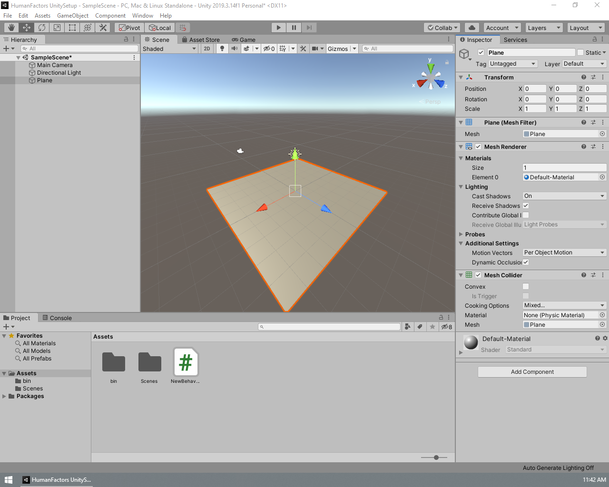

# The Graph Generator

## Before we begin

This guide will demonstrate the following tasks in HumanFactors

1) Passing an existing mesh from a Unity Scene to the HumanFactors Codebase.
2) Creating a BVH for the Embree Ray Tracer
3) Using the Graph Generator to Generate a Graph
4) Retrieving nodes from a HumanFactors Graph

We're going to be starting with the project from the previous guide: [Setting up a Unity Project For Human Factors](UnityProjectSetup.md). If you want to start here, you can download the zipped project from the bottom of the page. **Make sure you have all of the prerequisites before starting this guide.**

## Conceptual Overview

***TODO:*** How much should I flesh this out?

***TODO:*** Visuals?

To put it simply **Graph Generator** maps out "accessible" space on a model from a given starting point. As the name implies, this map of the space is stored as a series of nodes and edges in a **Graph**. Each node represents a point in space that a human can occupy, and each edge between nodes indicates that a human can traverse from one node to another node. The Graph Generator is a powerful tool for analyzing space, since the graph or nodes it outputs can be used as input to all of the analysis methods offered by HumanFactors. This allows the user to go straight from modifying a model or scene, to analyzing it with minimal effort.

## Scene Setup

For this walkthrough we're going to create a single plane in unity, then run the graph generator on it. To begin, open up the Unity Project from [Setting up a Unity Project For Human Factors](UnityProjectSetup.md).

From here we will create a new plane directly at the origin. Using the menubar at the top of the screen select GameObject > 3D Object > Plane.

Once clicked, a new 1x1 plane will have been created, however it may not have been created at the origin exactly. Click on the newly created plane and look at **Transform** header under the inspector in the right sidebar.

If, like in the above image, your plane wasn't created with a Position of X = 0, Y =0 and Z = 0, then you'll have to manually reset its position. This can be done by left clicking on the three dots in the transform header, and selecting *Reset Position*.

After clicking that button, your plane will be moved back to the origin like in the image below.

Now that we have the plane ready to go, it's time to create our script.

## Writing the Script
With the plane in the scene, lets set up our script before moving any further.

### Creating the script
Create a new script using the same process outlined in the first tutorial, except name this one `GraphOnPlane` by typing the name after clicking CreateScript. Now that our new script is created, double click on it to open up Visual Studio.

### Set Usings

### Setup for adding references through the unity inspector

### Getting the Mesh from a Game Object

### Generating the Graph

## Executing the Script

### Adding References Through the Unity Inspector

### Comparing Output

