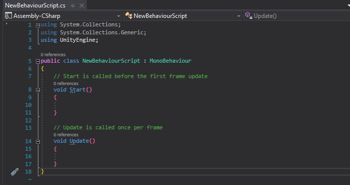
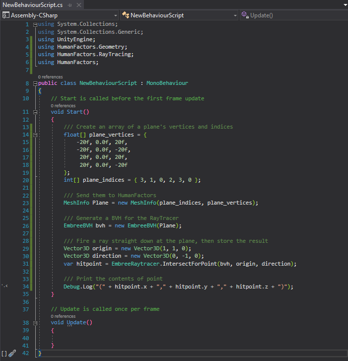
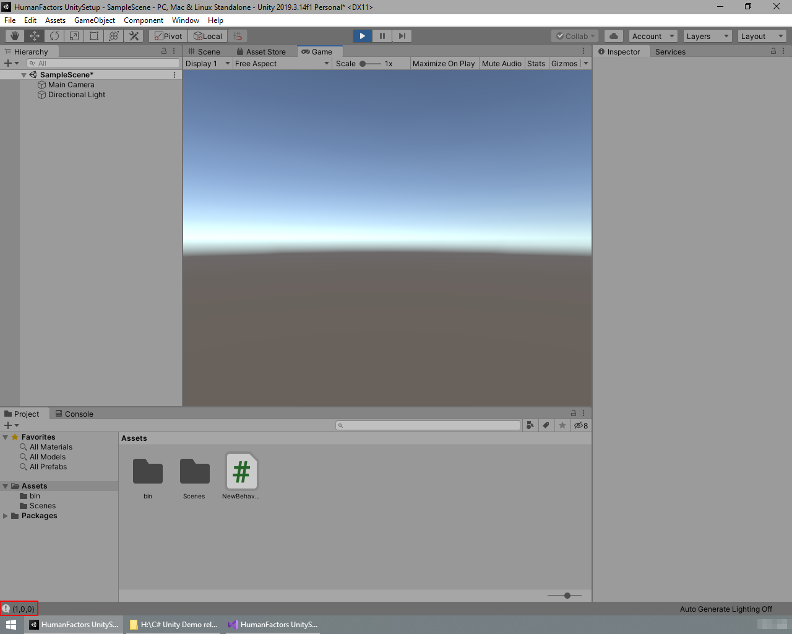

# Walkthrough

## Table of Contents
  - [Before we begin](#before-we-begin)
    - [Prerequisites](#prerequisites)
  - [Creating a new project](#creating-a-new-project)
  - [Importing The Human Factors Library](#importing-the-human-factors-library)
  - [Creating A Plane and Firing a Ray at it in HumanFactors](#creating-a-plane-and-firing-a-ray-at-it-in-humanfactors)
    - [Writing the Script](#writing-the-script)
    - [Testing the Script](#testing-the-script)

## Before we begin

 This guide will demonstrate setting up a new unity project from scratch, then importing the HumanFactors API and verifying that it's working. 

### Prerequisites

- An installation of [Unity](https://unity3d.com/get-unity/download). This project has been tested with Unity 2019.3f, but should work from 2018.3 on. 
- A copy of the HumanFactors release built with support for C#. The `bin` folder should contain the following files:

```
1. embree3.dll
2. HumanFactors.dll
3. HumanFactorsCSharp.dll
4. msvcp140.dll
5. System.Buffers.dll
6. System.Memory.dll
7. System.Runtime.CompilerServices.Unsafe.dll
8. tbb.dll
9. vcomp140.dll
10. vcruntime140.dll
11. vcruntime140_1.dll
```

- An installation of Visual Studio with Unity integration. Instructions for installing Visual Studio in Unity are available [here](https://docs.microsoft.com/en-us/visualstudio/cross-platform/getting-started-with-visual-studio-tools-for-unity?view=vs-2019).
  
## Creating a new project

Open up the Unity Hub then click the *NEW* button.
 a new unity project 

 Select your desired project type, directory, and project name. For the sake of this example, we will be using the *3D* project type, and naming our project *HumanFactorsUnitySetup*. When done with this, press the Create button to create the project and wait while unity imports all the necessary info.

 

Upon completion you should be greeted by an empty unity scene.


## Importing The Human Factors Library

Now that the project is set up, we need to place the binaries for HumanFactors in the assets folder so Unity can see and interface with them. Unzip the HumanFactors release package(Don't try to drag from a zipped folder you will get an error), then drag the `bin` folder into the assets window. If you don't see the assets window, then you can click the assets folder on the left side directly under the project tab.


To verify that the installation is working, we're going to create a small script that constructs a sample plane. Right click on a blank space in the assets window, mouse over *Create*, then select  then select *C# Script*.


Double click on the newly created script to open visual studio. If Mono-Develop appears instead then you do not have visual studio support for unity, and can follow the instructions in prerequisites to install it.


 In Visual Studio, navigate to the *Solution Explorer*, and expand the drop downs for your solution, Assembly-C-Sharp, and References. If everything was done correctly, you should see HumanFactors C# under the references for your project.


## Creating A Plane and Firing a Ray at it in HumanFactors

Now that we know the HumanFactors library can be referenced by our New Unity Project, lets check to see that it's working with a simple script. This script will perform the following when playmode is entered:

1) Create a Plane
2) Fire a ray at the plane
3) Get the point where the ray intersected the plane.

In the Visual Studio window you've just opened, Look at the contents of NewBehavior Script.cs It should match this image:



### Writing the Script

To reduce the length of calls into HumanFactors, we're going to declare which namespaces will be used in this script. Add the following lines to the top of the script

``` C#
using HumanFactors.Geometry;
using HumanFactors.RayTracing;
```

The top block of your script should look like this.


Now that we've declared what we're using HumanFactors, lets actually use it in our code. In the `Start()` function of new behaviour script, add the following code to create a new plane from a list of vertices/indices.

``` C#
        /// Create an array of a plane's vertices and indices
        float[] plane_vertices = {
            -20f, 0.0f, 20f,
            -20f, 0.0f, -20f,
             20f, 0.0f, 20f,
             20f, 0.0f, -20f
        };
        int[] plane_indices = { 3, 1, 0, 2, 3, 0 };

        /// Send them to HumanFactors
        MeshInfo Plane = new MeshInfo(plane_indices, plane_vertices);

        /// Generate a BVH for the RayTracer
        EmbreeBVH bvh = new EmbreeBVH(Plane);

        /// Fire a ray straight down at the plane, then store the result
        Vector3D origin = new Vector3D(1, 1, 0);
        Vector3D direction = new Vector3D(0, -1, 0);
        var hitpoint = EmbreeRaytracer.IntersectForPoint(bvh, origin, direction);

        /// Print the x, y, and z components of the hitpoint
        Debug.Log("(" + hitpoint.x + "," + hitpoint.y + "," + hitpoint.z + ")");
```

After finished your entire code should look like this. Once you've verified this is true, make sure to save it.



### Testing the Script

Now that we have a usable script, we need to attach it to some game object in order to run it. In the Unity Window drag *NewBehaviorScript.cs* to *Main Camera* in the scene hierarchy. Since *NewBehaviorScript* is a component of the *Main Camera*, its `Start()` function containing our sample code will be run when the editor enters play mode.


Click the play button (shown in blue below) to enter play mode, then look at your editor's console. If everything went right, then the console located at the bottom of your editor's window should show `(1,0,0)`, which is the exact point where the ray intersected the plane.



Here's a magnified image of the console's output shown in the red box.


If you've made it this far, then you're ready to move on to the Graph Generator. [Here's](../assets/walkthroughs/unity/1_project_setup/HumanFactors%20UnitySetup.zip) a zipped version of the entire Unity Project from this walkthrough.
